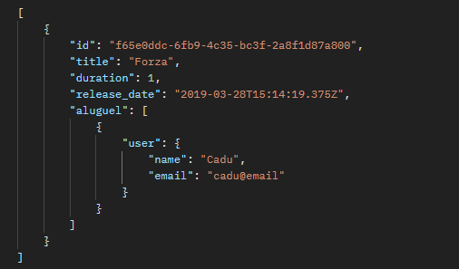
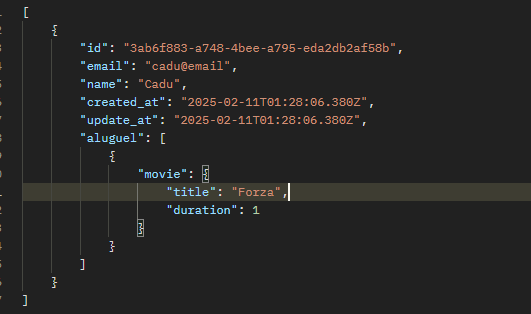

#### CRUD para Aluguéis de Filmes com Node e Prisma

###### Retorno da consulta de Filmes e seus Aluguéis por usuário

###### Retorno da consulta de usuários e seus filmes alugados

<!-- ## Comandos usados de instalação -->
<!-- npm init -y
npm add prisma ts-node-dev typescript @types/express -D
npm add @prisma/client express
npx prisma init
npm add express-async-errors
npm i -D @types/express@4  -->